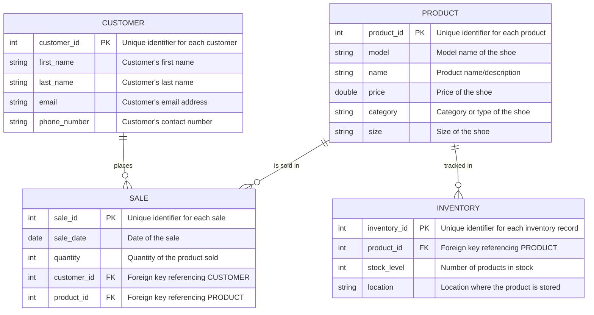

# Nike Shoe Store ERD

## Entity Descriptions

1. **PRODUCT**: Represents each unique Nike shoe model available for sale.
   - `product_id`: Unique identifier for each product.
   - `model`: Specific model name for the Nike shoe (e.g., "Air Max", "Air Force 1").
   - `name`: Detailed product name or description.
   - `price`: The retail price of the product.
   - `category`: Type of shoe (e.g., Running, Basketball, Casual).
   - `size`: Available sizes for the shoe.

2. **CUSTOMER**: Contains detailed information about the store’s customers.
   - `customer_id`: Unique identifier for each customer.
   - `first_name`: Customer’s first name.
   - `last_name`: Customer’s last name.
   - `email`: Email address for contacting the customer.
   - `phone_number`: Customer’s phone number.

3. **SALE**: Each record represents a sales transaction, linking customers to the products they purchase.
   - `sale_id`: Unique identifier for each sale.
   - `sale_date`: The date when the sale occurred.
   - `quantity`: The number of units sold in the transaction.
   - `customer_id`: Foreign key that references the `CUSTOMER` who made the purchase.
   - `product_id`: Foreign key that references the `PRODUCT` being sold.

4. **INVENTORY**: Tracks stock levels and storage locations for each product.
   - `inventory_id`: Unique identifier for each inventory record.
   - `product_id`: Foreign key that references the product being tracked.
   - `stock_level`: Current number of units in stock.
   - `location`: The specific location or warehouse where the product is stored.

## Relationship Descriptions
- **CUSTOMER to SALE**: A customer can place many sales, representing a one-to-many relationship.
- **PRODUCT to SALE**: A product can be part of multiple sales, showing a one-to-many relationship.
- **PRODUCT to INVENTORY**: Each product has an inventory record to track its stock, forming a one-to-one relationship.

## Scenario Description
The Nike Shoe Store sells Nike shoes and needs a database to keep track of products, customers, sales, and inventory. The goal is to build a database that connects everything together, making it easier to manage and keep up with what’s going on in the store. This ERD shows how the different parts (products, customers, sales, and inventory) are linked to each other so the store can run smoothly.

The four primary entities in the diagram are:

- **PRODUCT**: Represents various Nike shoe models available for sale.
- **CUSTOMER**: Stores information about customers who shop at the store.
- **SALE**: Keeps track of individual transactions and links customers to the products they purchase.
- **INVENTORY**: Tracks stock levels for each shoe model and where it is located.
